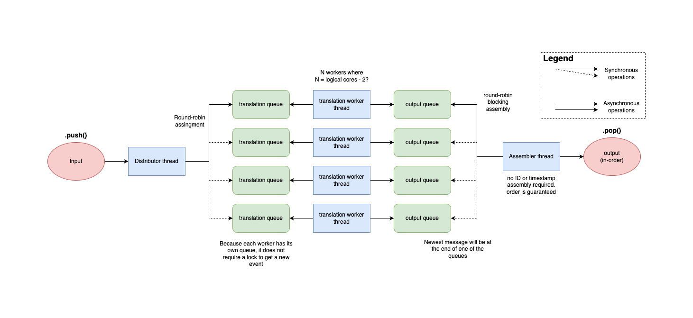

# ILF Library

Intermediate Log Format translator library. Contains ILF parsing code using a lockless implementation. This project is design as a dependency for c++ based ILF translator implementations. It is not designed to be compiled and run by itself.

## Usage

Include the ILF library in your code by adding it as a git [submodule](https://git-scm.com/book/en/v2/Git-Tools-Submodules).

## Development Details

Lockless implementation of the parser (i.e., 
translator) template. 

There are comments in parser.h that explain 
the interface and algorithm in greater 
detail, but at a high level, the lockless 
implementation functions by assigning each 
processing thread its own input and output 
queue. When calling `push`, insert data 
onto the next thread's input queue in a 
round robin fashion. When calling `pop`, 
remove data from the next thread's output 
queue in a round robin fashion. Each 
processing thread simply removes data from 
its input queue (if there is any), runs the 
given conversion function on it, and adds the 
output to its output queue. In this way, 
no processing thread is required to wait on 
another, and we maintain the original ordering 
of data.

Diagram by Bryan Quinn. 

Although this implementation is lockless, 
you could feasibly use the same algorithm, 
but manage each queue with locks instead. 
We use a third party GitHub repo for 
lockless queues [here](https://github.com/cameron314/readerwriterqueue).

There are some usage examples of the template 
in the test directory.

### Scalability

A fundamental problem with the current 
design of the template is that depending 
on the rate of pushing and popping data, 
this implementation could scale poorly 
as the number of cores increases. Specifically, 
if you have a translator that takes significantly 
more time to input or output data (e.g., 
read from a file or publish to Redis, which are 
both costly operations), then the template 
will perform poorly because everything is 
bottlenecked by the single producing or 
consuming thread. This could be mitigated 
by inputting and outputting data in 
batches (e.g., if reading from a file 
with `std::ifstream` in C++ or combining 
multiple ILFs into the same Redis call).

## License

This software is licensed under the Apache 2.0 license.

## Public Release

> [!NOTE]
> Approved for Public Release; Distribution Unlimited. Public Release Case
> Number 24-3961.